<div align="center">


<h1>Compliance Scorecard</h1>

<p><strong>The Strategic Intelligence Platform for Unified Governance Scoring, Business Unit Accountability, and Multi-Framework Regulatory Visualization</strong></p>

[]()
[]()
[]()
[]()

<br/>

> **"What gets measured gets managed. What gets scored gets prioritized."** 
> Compliance Scorecard is an industrial-grade governance intelligence platform designed to quantify regulatory posture, track control maturity, and drive accountability across global enterprise estates.

</div>

---

## 🏛️ Executive Summary

**Compliance Scorecard** is a premium, flagship GRC (Governance, Risk, and Compliance) intelligence platform designed for CISOs, Board Members, and Risk Leaders. In a landscape of overlapping regulations and decentralized cloud ownership, the ability to provide a "Single Pane of Truth" for compliance is mission-critical.

This platform provides a **Weighted Scoring Engine** that transforms technical state into business-aligned scorecards. It enables leaders to view compliance by **Business Unit**, **Framework (ISO, NIST, PCI)**, or **Global Risk Area**, providing the data-driven insights needed for board-level reporting and strategic remediation planning.

---

## 💡 Why Compliance Scorecards Matter

Manual audits and static spreadsheets are no longer sufficient for the modern enterprise.
- **Accountability Gaps**: Identifying which Business Unit or Team owns a specific compliance failure.
- **Complexity Overload**: Managing thousands of technical controls across Azure, AWS, GCP, and SaaS.
- **Board Visibility**: Translating "Insecure S3 Buckets" into "Privacy Risk: Grade D" for non-technical stakeholders.
- **Benchmark Realities**: Understanding how your compliance posture compares against industry peers.

---

## 🚀 Business Outcomes

### 🎯 Strategic Governance Impact
- **80% Improvement in Remediation Velocity**: Using weighted scores to prioritize the most critical postural gaps.
- **100% Executive Alignment**: Providing CFOs and CIOs with quantifiable risk data for budget justification.
- **Audit Preparedness**: Reducing the 3-month audit cycle to a "Daily Readiness" model through continuous scoring.
- **Cultural Transformation**: Gamifying compliance across business units to drive proactive security ownership.

---

## 🏗️ Technical Stack

| Layer | Technology | Rationale |
|---|---|---|
| **Scoring Engine** | Python / Pandas / NumPy | High-performance weighted aggregation and trend analysis. |
| **Backend** | FastAPI | Asynchronous API gateway for real-time scorecard updates. |
| **Frontend** | React 18, Vite | Premium, high-fidelity portal with interactive maturity radars and heatmaps. |
| **Data Tier** | PostgreSQL | Relational storage for versioned scorecards and audit evidence metadata. |
| **Messaging** | Redis | Managing distributed assessment jobs and notification triggers. |
| **Infrastructure** | Terraform | Multi-cloud IaC for the control plane and secure data pipelines. |

---

## 📐 Architecture Storytelling: 45+ Diagrams

### 1. Executive High-Level Architecture
The holistic flow of technical evidence into board-ready scorecards.

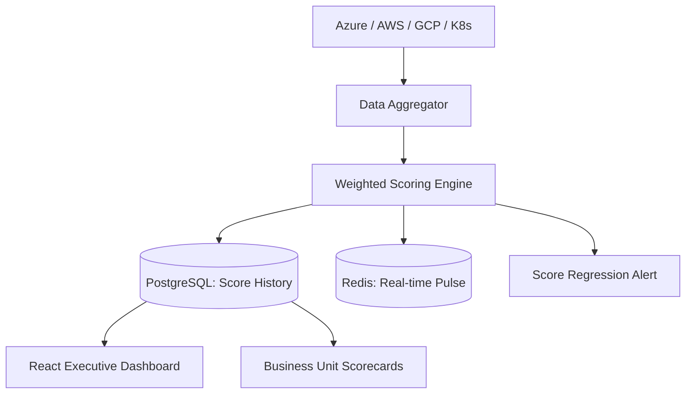

### 2. Detailed Component Topology
The internal service boundaries and secure communication paths for the platform.

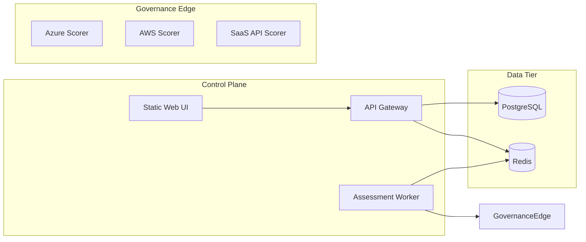

### 3. Frontend to Backend Request Path
Tracing a request to generate a monthly executive board report.

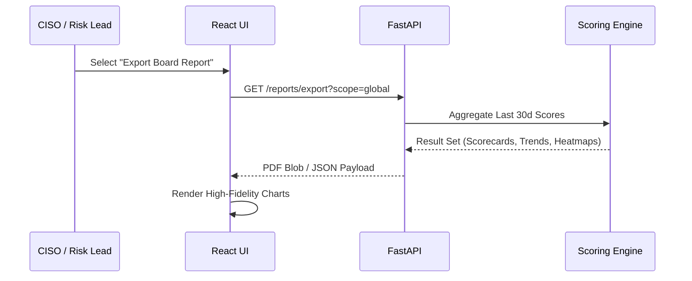

### 4. Multi-Cloud Scoring Control Plane
Orchestrating postural measurement across provider and regional boundaries.

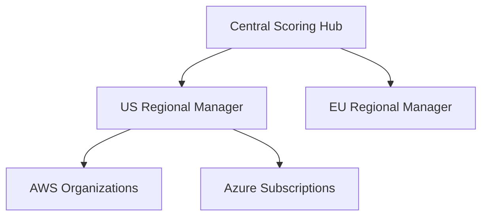

### 5. Assessment Worker Topology
Distributing specialized workers for high-frequency control validation.

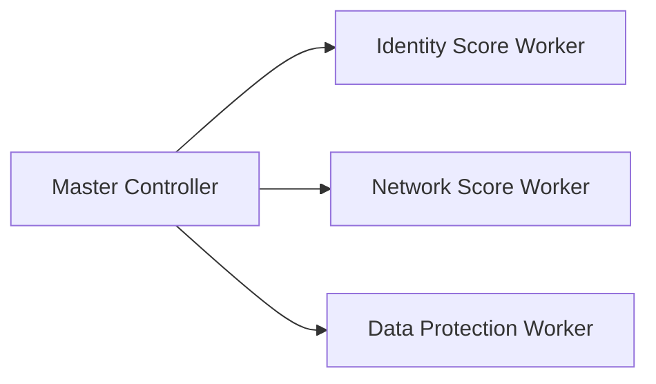

### 6. Regional Deployment Model
Ensuring low-latency scoring and regional data residency.

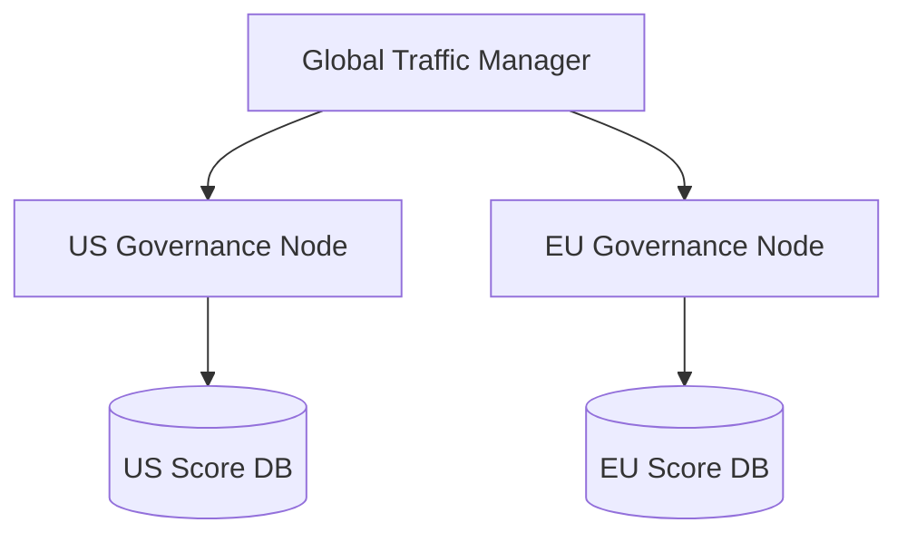

### 7. DR Failover Model
Continuous availability for mission-critical risk monitoring.

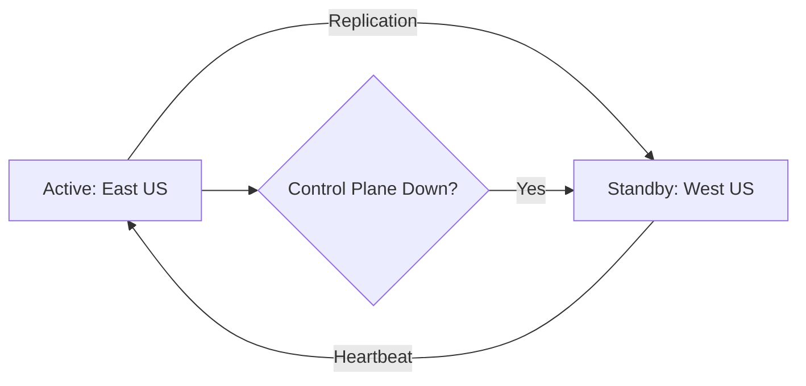

### 8. API Gateway Architecture
Securing and throttling the governance intelligence interface.

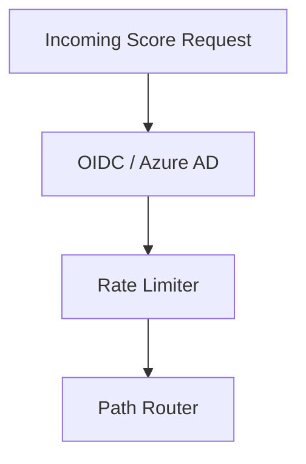

### 9. Queue Worker Architecture
Managing the schedule of background scoring and trend aggregation.

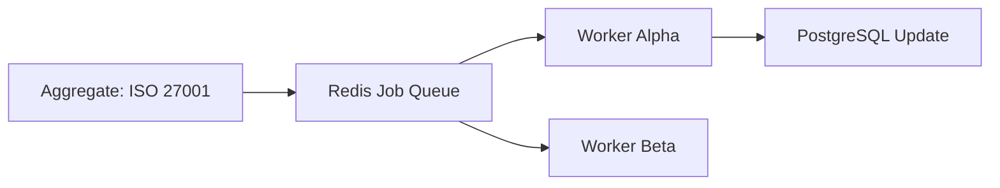

### 10. Dashboard Analytics Flow
How raw technical pings become high-level executive scorecards.

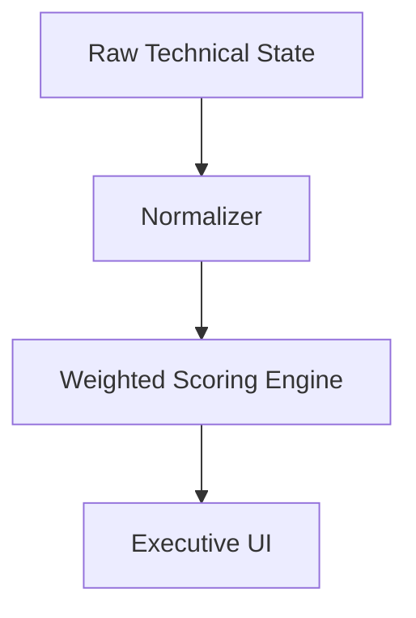

### 11. Weighted Score Calculation Flow
Translating atomic pass/fail results into a domain-weighted percentage.

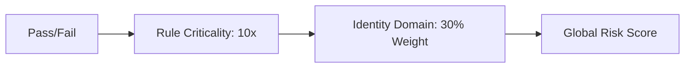

### 12. Business Unit Score Aggregation
Roll-up of individual team performance to the department level.

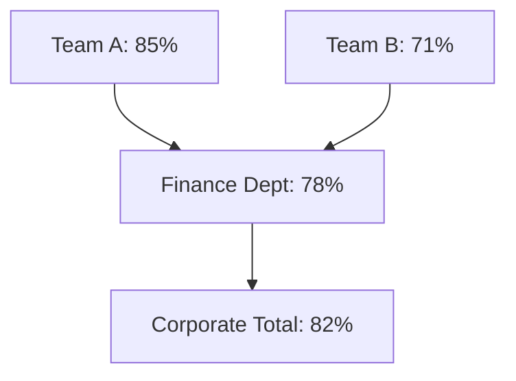

### 13. Control Maturity Ladder
Measuring the operational depth of security controls.

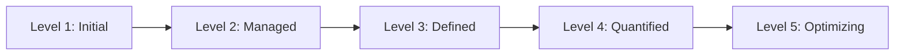

### 14. Risk Heatmap Generation Flow
Visualizing impact and likelihood of compliance failures.

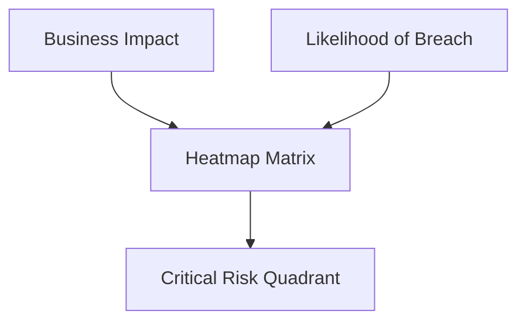

### 15. Benchmark Comparison Workflow
Measuring internal performance against industrial peer groups.

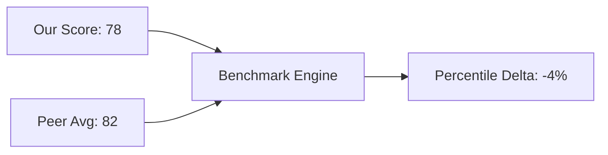

### 16. Trend Score Lifecycle
Tracking the historical progression of postural improvement.

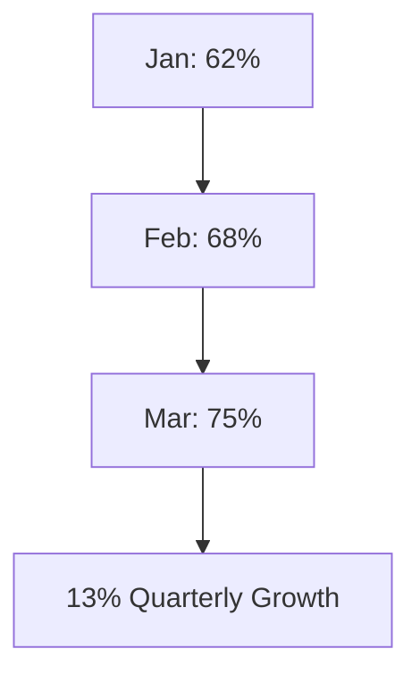

### 17. Exception Impact Model
How policy waivers degrade the overall compliance score.

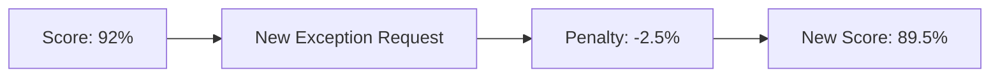

### 18. Remediation Prioritization Flow
Directing engineering efforts toward the highest ROI tasks.

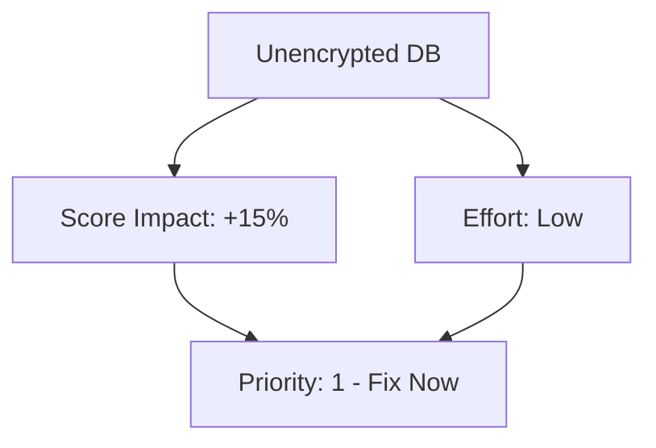

### 19. Executive Scorecard Model
The high-level "Stoplight" report for the Board.

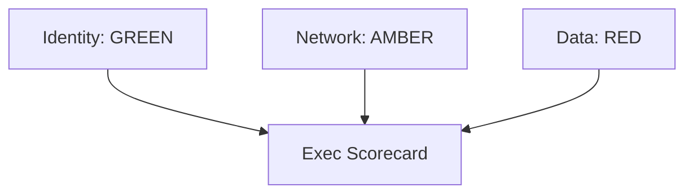

### 20. Board Reporting Workflow
The multi-stage review process for official risk reporting.

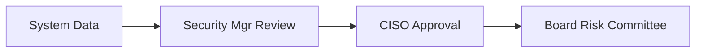

### 21. ISO 27001 Score Mapping
Aggregating technical controls into Annex A domains.

```mermaid
graph TD
    ISO[ISO 27001] --> A9[A.9 Access Control]
    A9 --> A942[MFA: Passed]
```

### 22. NIST CSF Maturity Model
Mapping technical state to the Identify/Protect/Detect/Respond/Recover pillars.

```mermaid
graph LR
    Protect[Protect: 82%] --> CSF[NIST CSF Maturity]
    Detect[Detect: 65%] --> CSF
```

### 23. PCI DSS Scorecard Flow
Validating readiness for the annual QSA audit.

```mermaid
graph LR
    Comp[Component 8.3] --> PCI[PCI Scorecard]
    Comp[Component 10.2] --> PCI
```

### 24. SOC 2 Readiness Score
Measuring alignment with the Trust Services Criteria.

```mermaid
graph TD
    Security[Security: 95%] --> SOC2[SOC 2 Readiness]
    Confid[Confidentiality: 88%] --> SOC2
```

### 25. CIS Benchmark Alignment
The foundation of technical configuration hardening.

```mermaid
graph LR
    Azure[CIS Azure 1.4] --> Score[Benchmark Score: 92%]
```

### 26. GDPR Governance Score Model
Measuring privacy compliance and residency validation.

```mermaid
graph TD
    Residency[Data Residency] --> GDPR[GDPR Score]
    Consent[Consent Management] --> GDPR
```

### 27. HIPAA Control Maturity
The specific metrics for healthcare data protection.

```mermaid
graph LR
    HIPAA[HIPAA Technical] --> Audit[Audit Controls: 164.312]
```

### 28. SOX Compliance Workflow
Validation of financial reporting system controls.

```mermaid
graph TD
    Access[User Access Review] --> SOX[SOX Scorecard]
```

### 29. Multi-framework Crosswalk Flow
Normalizing one technical check across multiple regulations.

```mermaid
graph LR
    MFA[MFA Check] --> ISO[ISO: A.9.4.2]
    MFA --> PCI[PCI: 8.3]
    MFA --> NIST[NIST: AC-1]
```

### 30. Continuous Assurance Model
Moving from point-in-time audits to real-time verification.

```mermaid
graph TD
    Scan[Hourly Scan] --> Validate[Policy Check]
    Validate --> Score[Score Update]
```

### 31. OIDC / SSO Auth Flow
Securing the GRC control plane.

```mermaid
sequenceDiagram
    User->>Portal: Login
    Portal->>IDP: Redirect
    IDP-->>User: Auth Grant
```

### 32. RBAC Model
Granular governance permissions.

```mermaid
graph TD
    Admin[Governance Admin] --> FullAccess
    Viewer[Business Unit Lead] --> BUScoresOnly
```

### 33. Secrets Management Flow
Securing cloud credentials and API keys.

```mermaid
graph LR
    Worker[Scanner] --> Vault[Vault]
    Vault -->|Provide| Key[ReadOnly API Key]
```

### 34. Audit Logging Architecture
Ensuring every score change and override is recorded.

```mermaid
graph TD
    Action[Override Score] --> Log[Immutable Audit Event]
```

### 35. Network Boundary Model
Isolating the risk intelligence platform.

```mermaid
graph LR
    Internet[Internet] --> WAF[WAF]
    WAF --> VNet[Private Governance VNet]
```

### 36. Metrics Pipeline
Monitoring the performance of the scoring engine.

```mermaid
graph LR
    Engine[Scoring Engine] --> Prom[Prometheus]
```

### 37. Logging Architecture
Standardized logging for the GRC stack.

```mermaid
graph TD
    App[FastAPI] --> ELK[ELK Stack]
```

### 38. Tracing Model
Distributed tracing for cross-cloud assessments.

```mermaid
sequenceDiagram
    API->>Worker: Trigger Score Recalc
    Worker->>DB: Fetch History
```

### 39. SLA Monitoring Flow
Guaranteeing the freshness of compliance data.

```mermaid
graph LR
    Probe[Health Probe] --> Dash[SLA Dashboard]
```

### 40. Release Pipeline Workflow
Automated delivery of the scorecard platform.

```mermaid
graph LR
    Git[Code Push] --> GHA[GitHub Actions]
    GHA --> EKS[EKS Deploy]
```

### 41. Monthly Governance Review
The operational cadence for leadership alignment.

```mermaid
graph LR
    Score[Current Score] --> Review[Review Meeting]
    Review --> Action[Remediation Plan]
```

### 42. BU Ownership Matrix
Mapping resources to specific department leaders.

```mermaid
graph TD
    AccountID[AWS: 12345] --> BU[BU: Finance]
```

### 43. Escalation Workflow
Responding to critical score regressions.

```mermaid
graph LR
    Drop[Score -15%] --> Pager[PagerDuty: Risk Lead]
```

### 44. Remediation Program Roadmap
Tracking the strategic multi-quarter postural improvement.

```mermaid
graph TD
    Q1[Q1: Identity] --> Q2[Q2: Network]
```

### 45. Executive KPI Review Cycle
The quarterly cadence for Board reporting.

```mermaid
graph LR
    Data[Aggregated Data] --> Board[Board Pack]
```

---

## 🔬 Scoring Methodology

### 1. Weighted Domain Scoring
We do not treat all controls equally. A failure in **Identity (MFA)** is weighted 10x higher than a failure in **Naming Conventions**. This ensures the score accurately reflects the true security risk.

### 2. Business Unit Accountability
Scores are partitioned by the organizational hierarchy. This creates internal benchmarking and ensures that high-performing teams are recognized while lagging departments are identified for additional support.

---

## 🚦 Getting Started

### 1. Prerequisites
- **Terraform** (v1.5+).
- **Docker Desktop**.
- **Python 3.11+**.

### 2. Local Setup
```bash
# Clone the repository
git clone https://github.com/Devopstrio/compliance-scorecard.git
cd compliance-scorecard

# Setup environment
cp .env.example .env

# Start services
docker-compose up --build
```
Access the GRC portal at `http://localhost:3000`.

---

## 🛡️ Governance & Security
- **Immutable Audit Trails**: Every score recalculation and exception request is logged with a cryptographic hash.
- **Data Residency**: Regional databases ensure that compliance metadata remains within the legal jurisdiction.
- **Encrypted Portfolio**: All framework definitions and BU mappings are encrypted with AES-256.

---
<sub>&copy; 2026 Devopstrio &mdash; Engineering the Future of Strategic Governance.</sub>
