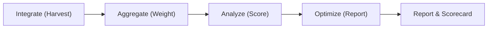
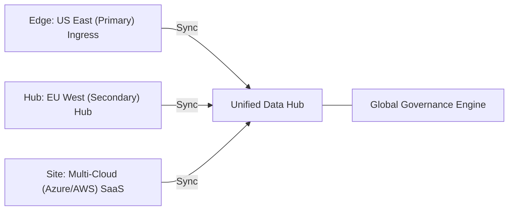
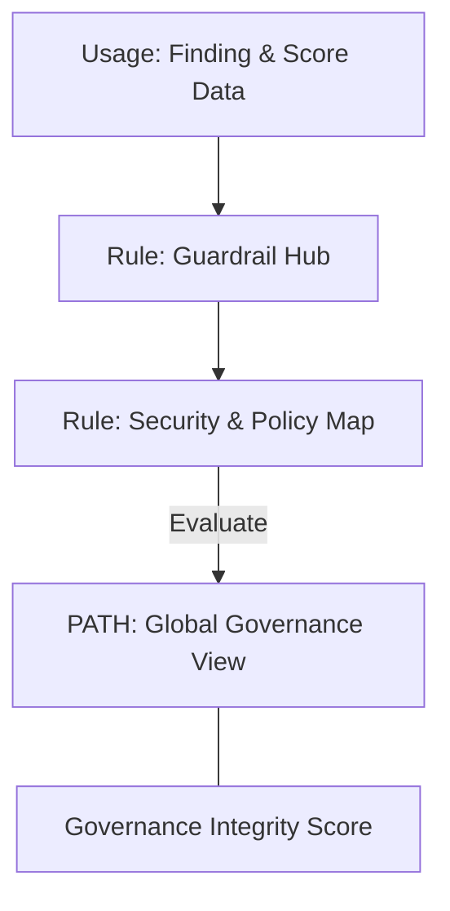
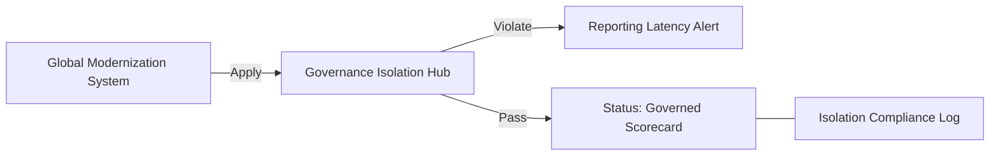
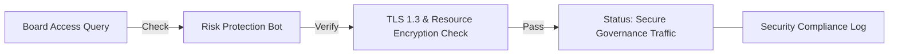
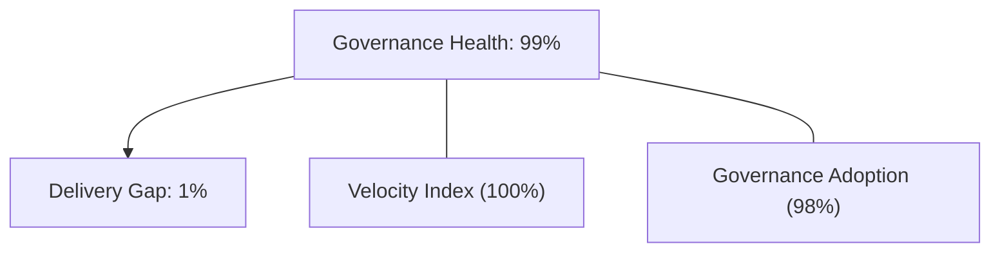
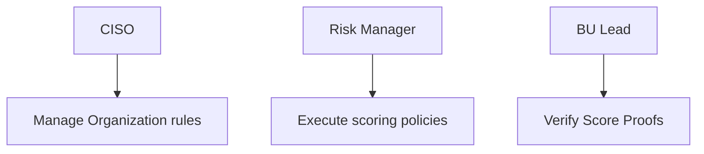
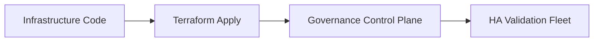
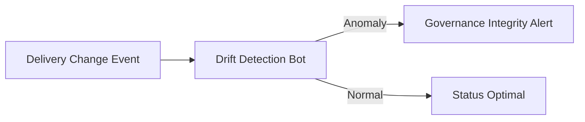
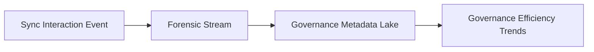

<div align="center">


<h1>Compliance Scorecard</h1>

<p><strong>The Institutional-Grade Platform for Standardized Compliance Foundations, Risk Governance, and Multi-Cloud Scorecard Ecosystems.</strong></p>

[]()
[]()
[]()

<br/>

> **"Industrializing risk governance to automate compliance foundations."** 
> **Compliance Scorecard** is an enterprise-grade platform designed to provide a secure, measurable, and highly automated foundation for global compliance operations. It orchestrates the complex lifecycle of risk measurement—from weighted domain scoring and multi-framework mapping to high-throughput executive reporting and unified governance auditing.

</div>

---

## 🏛️ Executive Summary

Fragmented risk visibility and manual compliance tracking are strategic operational liabilities; lack of a standardized scorecard framework is a primary barrier to organizational engineering maturity. Organizations fail to govern their risk posture not because of a lack of controls, but because of fragmented measurement standards, lack of automated accountability, and an inability to orchestrate governance planes with operational precision.

This platform provides the **Risk Intelligence Plane**. It implements a complete **Compliance-Scorecard-as-Code Framework**, enabling CISOs and Risk Managers to manage global compliance foundations as first-class citizens. By automating the identification of postural regressions through real-time telemetry analysis and orchestrating the provisioning of secure performance-driven governance policies, we ensure that every organizational unit—from central IT squads to distributed business domains—is scored by default, audited for history, and strictly aligned with institutional governance frameworks.

---

## 📐 Architecture Storytelling: Principal Reference Models

### 1. Principal Architecture: Global Compliance Scorecard & Risk Intelligence Plane
This diagram illustrates the end-to-end flow from compliance telemetry ingestion and multi-cloud orchestration to scorecard enforcement, performance validation, and institutional governance auditing.


```mermaid
graph LR
    %% Subgraph Definitions
    subgraph ComplianceIngress["Technical & Framework Ingress"]
        direction TB
        Technical_Signals["Cloud (CSPM) / K8s / SaaS Logs"]
        Regulatory_Pillars["ISO 27001 / NIST / PCI DSS"]
        Org_Accountability["Business Unit / Team Mappings"]
    end

    subgraph IntelligenceEngine["Risk Intelligence Hub"]
        direction TB
        API["FastAPI Governance Gateway"]
        ScoringOrchestrator["Global Weighted Scoring Hub"]
        Governance_Hub["Compliance & Guardrail Hub"]
        AIOps_Validator["Drift & Regression Analysis Hub"]
    end

    subgraph OperationsPlane["Distributed Governance Ecosystem"]
        direction TB
        ManagedScorecards["Managed Standardized Scorecards"]
        ActivePipelines["Managed Automated Remediation Pipes"]
        ReportingSinks["Managed Infrastructure Delivery Hubs"]
    end

    subgraph OperationsHub["Institutional Data Hub"]
        direction TB
        Scorecard["Governance Maturity Scorecard"]
        Analytics["Discovery Flow & Accuracy Velocity Stats"]
        Audit["Forensic Governance Metadata Lake"]
    end

    subgraph DevOps["Compliance-Scorecard-as-Code Framework"]
        direction TB
        TF["Terraform Governance Modules"]
        DriftBot["Productivity & Config Drift Validator"]
        ChatOps["Measurement Operations Hub"]
    end

    %% Flow Arrows
    ComplianceIngress -->|1. Submit Telemetry| API
    API -->|2. Orchestrate Governance| ScoringOrchestrator
    ScoringOrchestrator -->|3. Apply Privacy Guard| Governance_Hub
    Governance_Hub -->|4. Assess Drift| AIOps_Validator
    
    AIOps_Validator -->|5. Execute Scoring| OperationsPlane
    OperationsPlane -->|6. Notify Status| ChatOps
    API -->|7. Visualize Health| Scorecard
    
    Scorecard -->|8. Track Maturity| Analytics
    Scorecard -->|9. Record Performance| Audit
    
    TF -->|10. Provision Backbone| IntelligenceEngine
    DriftBot -->|11. Inject Friction Risk| ScoringOrchestrator
    Audit -->|12. Improve Operations| ManagedScorecards

    %% Styling
    classDef ingress fill:#f5f5f5,stroke:#616161,stroke-width:2px;
    classDef intel fill:#e8eaf6,stroke:#1a237e,stroke-width:2px;
    classDef operations fill:#e1f5fe,stroke:#01579b,stroke-width:2px;
    classDef ops fill:#ede7f6,stroke:#311b92,stroke-width:2px;
    classDef devops fill:#e8f5e9,stroke:#1b5e20,stroke-width:2px;

    class ComplianceIngress ingress;
    class IntelligenceEngine intel;
    class OperationsPlane operations;
    class OperationsHub ops;
    class DevOps devops;
```

### 2. The Scoring Lifecycle Flow
The continuous path of a compliance scorecard platform from initial integration (harvest) and aggregation (weight) to active analysis (score), optimization (report), and institutional forensic auditing (scorecard).


```mermaid
graph LR
    Integrate["Integrate (Harvest)"] --> Aggregate["Aggregate (Weight)"]
    Aggregate --> Analyze["Analyze (Score)"]
    Analyze --> Optimize["Optimize (Report)"]
    Optimize --> Report["Report & Scorecard"]
```

### 3. Distributed Governance Topology
Strategically orchestrating standardized governance across global data regions, diverse cloud architectures, and multi-cloud targets, providing a unified institutional view of global governance health and operational readiness.


```mermaid
graph LR
    RegionA["Edge: US East (Primary) Ingress"] -->|Sync| Hub["Unified Data Hub"]
    BU["Hub: EU West (Secondary) Hub"] -->|Sync| Hub
    Cloud["Site: Multi-Cloud (Azure/AWS) SaaS"] -->|Sync| Hub
    Hub --- Logic["Global Governance Engine"]
```

### 4. Governance Hub & High-Trust Data Plane Protection Flow
Executing complex logic for securing the bridge between risk owners and technical teams, ensuring every organizational identity is verified, metadata-level privacy is maintained, and every governance access is according to institutional standards.


```mermaid
graph TD
    GovernanceData["Usage: Finding & Score Data"] --> Bridge["Rule: Guardrail Hub"]
    Bridge --> PolicyMap["Rule: Security & Policy Map"]
    PolicyMap -->|Evaluate| Context["PATH: Global Governance View"]
    Context --- Estimate["Governance Integrity Score"]
```

### 5. Multi-Cloud Governance Federation & Governance Flow
Automatically managing unified governance standards across global regions and diverse cloud tenants, ensuring institutional data residency and privacy boundaries by default.


```mermaid
graph LR
    Org["Global Modernization System"] -->|Apply| Guard["Governance Isolation Hub"]
    Guard -->|Violate| Alert["Reporting Latency Alert"]
    Guard -->|Pass| Verify["Status: Governed Scorecard"]
    Verify --- Audit["Isolation Compliance Log"]
```

### 6. Encryption & Perimeter Protection Flow (Governance Standard)
Managing the lifecycle of a governance request, automatically enforcing institutional TLS 1.3 and resource encryption standards as required by security policy, ensuring zero-latency security confidence.


```mermaid
graph LR
    GovernanceReq["Board Access Query"] -->|Check| Gatekeeper["Risk Protection Bot"]
    Gatekeeper -->|Verify| TLS["TLS 1.3 & Resource Encryption Check"]
    TLS -->|Pass| Admit["Status: Secure Governance Traffic"]
    Admit --- Audit["Security Compliance Log"]
```

### 7. Institutional Governance Maturity Scorecard
Grading organizational performance based on key indicators: Remediation Velocity Index, Domain Compliance Index, and Governance Adoption Scores.


```mermaid
graph TD
    Post["Governance Health: 99%"] --> Risk["Delivery Gap: 1%"]
    Post --- C1["Velocity Index (100%)"]
    Post --- C2["Governance Adoption (98%)"]
```

### 8. Identity & RBAC for Governance
Managing fine-grained access to governance hubs, provisioning workers, and audit logs between CISOs, Risk Managers, and Business Unit Leads.


```mermaid
graph TD
    CISO["CISO"] --> Hub["Manage Organization rules"]
    Manager["Risk Manager"] --> Exec["Execute scoring policies"]
    Lead["BU Lead"] --> Audit["Verify Score Proofs"]
```

### 9. IaC Deployment: Compliance-Scorecard-as-Code Framework
Using modular Terraform to deploy and manage the versioned distribution of the governance tracking hubs, scoring protection workers, and forensic metadata lakes.


```mermaid
graph LR
    HCL["Infrastructure Code"] --> TF["Terraform Apply"]
    TF --> Engine["Governance Control Plane"]
    Engine --> Clusters["HA Validation Fleet"]
```

### 10. AIOps Governance Drift & Risk Validation Flow
Using advanced analytics to identify sudden surges in risk findings, unauthorized score changes, suspicious configuration drifts, or unusual delivery pattern changes that could result in institutional risk or audit failure.


```mermaid
graph LR
    Drift["Delivery Change Event"] --> Analyzer["Drift Detection Bot"]
    Analyzer -->|Anomaly| Alert["Governance Integrity Alert"]
    Analyzer -->|Normal| Pass["Status Optimal"]
```

### 11. Metadata Lake for Forensic Governance Audit
Storing long-term records of every governance integration event (metadata), every score executed, and every version history for institutional record-keeping, compliance auditing, and post-provisioning forensics.


```mermaid
graph LR
    Provision["Sync Interaction Event"] --> Stream["Forensic Stream"]
    Stream --> Lake["Governance Metadata Lake"]
    Lake --> Trends["Governance Efficiency Trends"]
```

---

## 🏛️ Core Governance Pillars

1.  **Unified Foundation Coordination**: Maximizing resilience by centralizing all governance measurement through a single institutional plane.
2.  **Automated Scorecard Provisioning**: Eliminating "manual tracking" scenarios through proactive orchestration and pattern verification.
3.  **Sequential Risk Intelligence**: Ensuring zero-interruption operations through dependency-aware risk-driven data engineering.
4.  **Zero-Trust Identity Protection**: Automatically enforcing identity-based access, data-at-rest encryption, and policy evaluation across all discovery tiers.
5.  **Autonomous Operations Logic**: Guaranteeing reliability through automated industry-specific effectiveness monitoring runbooks.
6.  **Full Governance Auditability**: Immutable recording of every score change and governance provision for institutional forensics.

---

## 🛠️ Technical Stack & Implementation

### Governance Engine & APIs
*   **Framework**: Python 3.11+ / FastAPI.
*   **Performance Engine**: Custom Python-based logic for multi-framework mapping and DORA-style risk metrics.
*   **Integrations**: Native connectors for Azure, AWS, GCP, and GRC toolchains.
*   **Persistence**: PostgreSQL (Governance Ledger) and Redis (Live Scoring State).
*   **Auth Orchestrator**: Federated OIDC/SAML for least-privilege governance management access.

### Governance Dashboard (UI)
*   **Framework**: React 18 / Vite.
*   **Theme**: Dark, Slate, Indigo (Modern high-fidelity productivity aesthetic).
*   **Visualization**: D3.js for delivery topologies and Recharts for accuracy velocity analytics.

### Infrastructure & DevOps
*   **Runtime**: AWS EKS or Azure Kubernetes Service (AKS) for management plane.
*   **Measurement Hub**: Managed event sourcing for immutable productivity timeline reconstruction.
*   **IaC**: Modular Terraform for deploying the governance landing zone and validation fleet.

---

## 🏗️ IaC Mapping (Module Structure)

| Module | Purpose | Real Services |
| :--- | :--- | :--- |
| **`infrastructure/governance_hub`** | Central management plane | EKS, PostgreSQL, Redis |
| **`infrastructure/enforcers`** | Distributed scorecard provisioners | Azure, AWS, GCP APIs |
| **`infrastructure/scoring_pipes`** | Data Ingestion Hubs | Webhooks, Lambda |
| **`infrastructure/auditing`** | Forensic modernization sinks | S3, Athena, Quicksight |

---

## 🚀 Deployment Guide

### Local Principal Environment
```bash
# Clone the Compliance Scorecard repository
git clone https://github.com/devopstrio/compliance-scorecard.git
cd compliance-scorecard

# Configure environment
cp .env.example .env

# Launch the Governance stack
make init

# Trigger a mock governance update and automated guardrail validation simulation
make simulate-scorecard
```

Access the Management Portal at `http://localhost:3000`.

---

## 📜 License
Distributed under the MIT License. See `LICENSE` for more information.

---
<div align="center">
  <p>© 2026 Devopstrio. All rights reserved.</p>
</div>
